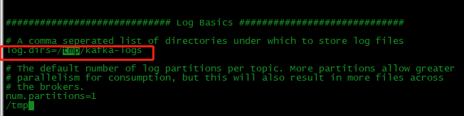
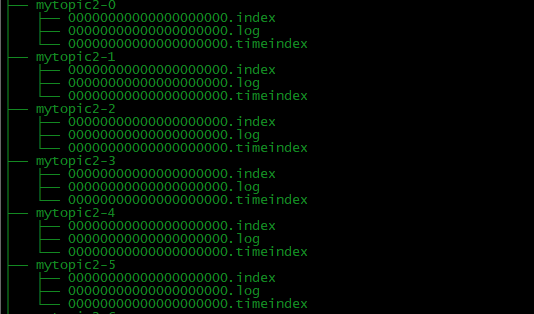

# Kafka 中的底层存储设计
> Segment 是kafka文件存储的最小单位
- 日志存放目录  kafka_2.10-0.10.2.1/config/server.properties <br>

<br>
进入到日志目录查看<br>

<br>
在kafka的文件存储中，同一个topic下有多个不同的Partition，每个partition都为一个目录，而每一个目录又被平均分配成多个大小相等的Segment File中，Segment File 包括一个日志数据文件和两个索引文件(偏移量索引文件和消息时间戳索引文件)。


- ./kafka-run-class.sh kafka.tools.DumpLogSegments --files /tmp/kafka-logs/__consumer_offsets-0/00000000000000000000.log --print-data-log

```
Starting offset: 12
baseOffset: 12 lastOffset: 12 count: 1 baseSequence: -1 lastSequence: -1 producerId: -1 producerEpoch: -1 partitionLeaderEpoch: 0 isTransactional: false isControl: false position: 0 CreateTime: 1560145317620 size: 136 magic: 2 compresscodec: NONE crc: 692425981 isvalid: true
| offset: 12 CreateTime: 1560145317620 keysize: -1 valuesize: 66 sequence: -1 headerKeys: [] payload: {"path":"/matchingHandler.userCancel","query":{"uid":"200208305"}}
baseOffset: 13 lastOffset: 13 count: 1 baseSequence: -1 lastSequence: -1 producerId: -1 producerEpoch: -1 partitionLeaderEpoch: 0 isTransactional: false isControl: false position: 136 CreateTime: 1560237884593 size: 136 magic: 2 compresscodec: NONE crc: 2666499378 isvalid: true
| offset: 13 CreateTime: 1560237884593 keysize: -1 valuesize: 66 sequence: -1 headerKeys: [] payload: {"path":"/matchingHandler.userCancel","query":{"uid":"200208631"}}
baseOffset: 14 lastOffset: 14 count: 1 baseSequence: -1 lastSequence: -1 producerId: -1 producerEpoch: -1 partitionLeaderEpoch: 0 isTransactional: false isControl: false position: 272 CreateTime: 1560323094331 size: 136 magic: 2 compresscodec: NONE crc: 926590729 isvalid: true
| offset: 14 CreateTime: 1560323094331 keysize: -1 valuesize: 66 sequence: -1 headerKeys: [] payload: {"path":"/matchingHandler.userCancel","query":{"uid":"200208305"}}
baseOffset: 15 lastOffset: 15 count: 1 baseSequence: -1 lastSequence: -1 producerId: -1 producerEpoch: -1 partitionLeaderEpoch: 0 isTransactional: false isControl: false position: 408 CreateTime: 1560421275824 size: 136 magic: 2 compresscodec: NONE crc: 3081157511 isvalid: true
| offset: 15 CreateTime: 1560421275824 keysize: -1 valuesize: 66 sequence: -1 headerKeys: [] payload: {"path":"/matchingHandler.userCancel","query":{"uid":"200208300"}}
baseOffset: 16 lastOffset: 16 count: 1 baseSequence: -1 lastSequence: -1 producerId: -1 producerEpoch: -1 partitionLeaderEpoch: 0 isTransactional: false isControl: false position: 544 CreateTime: 1560426875868 size: 136 magic: 2 compresscodec: NONE crc: 101509911 isvalid: true
```
Segment文件命名规则：Partition全局的第一个Segment从0开始，后续每个Segment文件名为上一个Segment文件最后一条消息的offset值。数值最大为64位long型，19位数字字符长度，没有数字用0填充。

|    关键字    | 解释 |
| ---------- | --- |
| offset |  消息在partition中的绝对offset。能表示这是partition的第多少条消息 |
| message       |  message大小

https://blog.csdn.net/lkforce/article/details/77854813 |