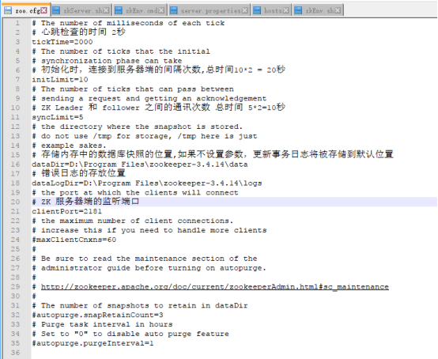
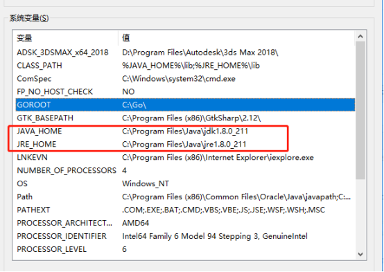
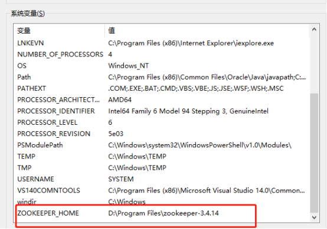
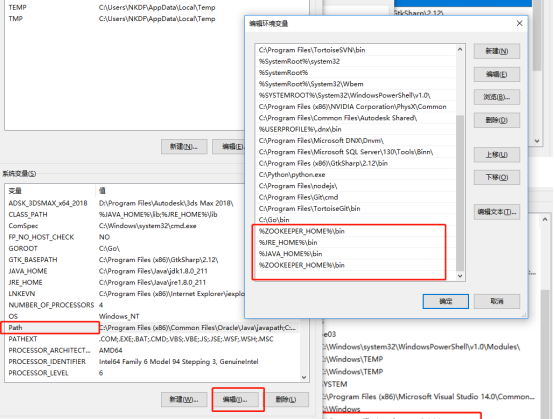
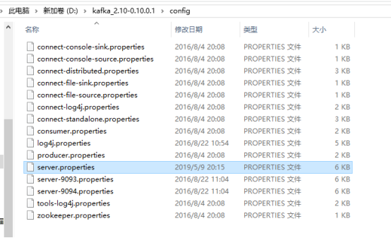
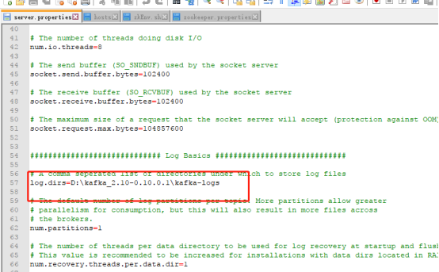
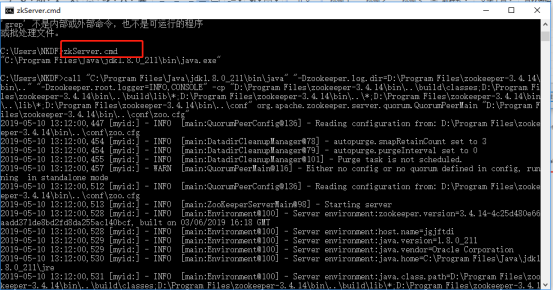
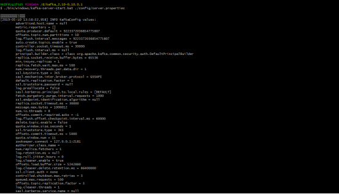

# kafka windows安装流程

> 安装步骤
- 下载依赖模块
- - zookeeper-3.4.14.tar.gz 地址：https://www-us.apache.org/dist/zookeeper/zookeeper-3.4.14/zookeeper-3.4.14.tar.gz
- - kafka_2.10-0.10.0.1.zip
- - jdk-8u211-windows-x64.exe 地址：http://www.oracle.com/technetwork/java/javase/downloads/jdk8-downloads-2133151.html
- - 下载完成解压模块
> 拷贝模块到指定目录
- 拷贝zookeeper文件到D:\Program Files 

- 进入D:\Program Files\zookeeper-3.4.14\conf  复制zoo_sample.cfg重命名成zoo.cfg 修改配置如下 

> 环境变量配置
- 我的电脑-属性 打开系统面板--点击高级系统设置--高级--环境变量 

> kafka环境配置  拷贝到指定目录 

- 修改默认配置 

- 配置log目录 

> 配置好系统变量  Win+R  打开cmd界面 输入zkServer.cmd，下图为zookeeper服务器启动成功 

> 进入D:\kafka_2.10-0.10.0.1  执行 ./bin/windows/kafka-server-start.bat ./config/server.properties 
